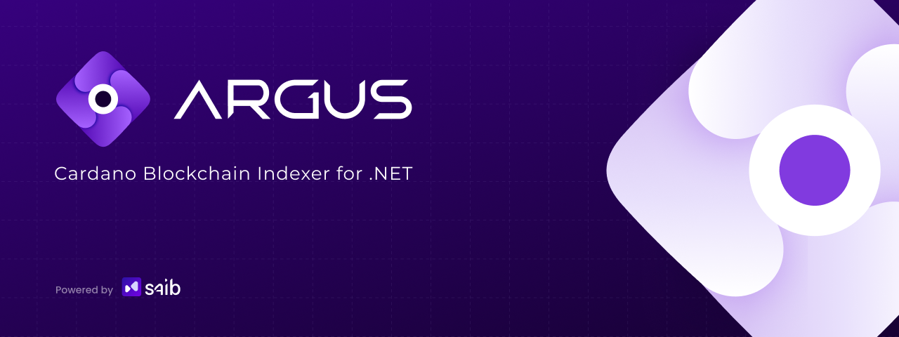
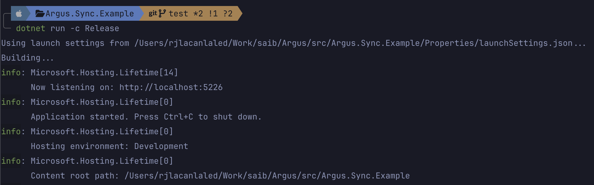
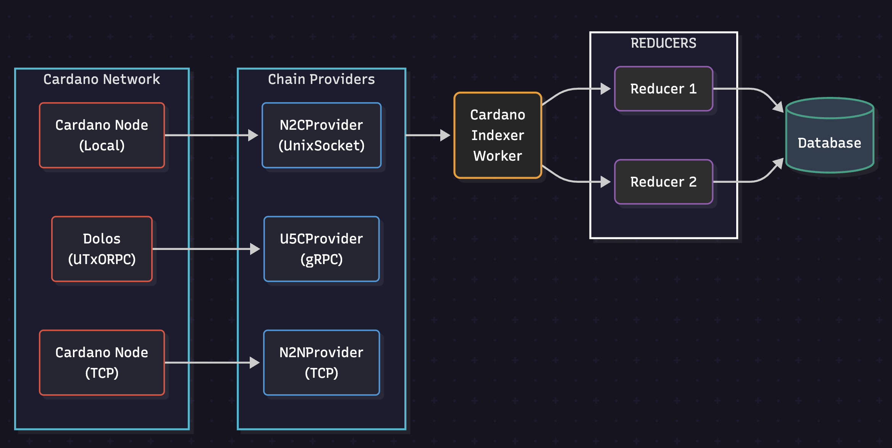

<div align="center">
  
  
  <a href="https://www.nuget.org/packages/Argus.Sync">
    
  </a>
  <a href="https://github.com/SAIB-Inc/Argus/blob/main/LICENSE">
    
  </a>
  <a href="https://github.com/SAIB-Inc/Argus/fork">
    
  </a>
  <a href="https://github.com/SAIB-Inc/Argus/stargazers">
    
  </a>
  <a href="https://github.com/SAIB-Inc/Argus/graphs/contributors">
    
  </a>
  <br>
  <a href="https://dotnet.microsoft.com/download">
    
  </a>
  <a href="https://www.postgresql.org/">
    
  </a>
  <a href="https://cardano.org/">
    
  </a>
</div>

## 📖 Overview

Argus is a .NET library that simplifies interactions with the Cardano blockchain by providing an efficient indexing framework. It processes block data into structured, queryable formats stored in a database, making blockchain data easier to work with for .NET developers.

🎥 **Video Tutorial**: For a detailed explanation and demo, check out [this video](https://x.com/clarkalesna/status/1859042521856532883)!

**Key Components:**

- 🔍 **Blockchain Indexing** - Transform raw blockchain data into structured database records
- 🧩 **Reducers** - Define the transformation logic for blockchain data
- 🔄 **Chain Providers** - Connect to Cardano nodes through various protocols
- 📊 **CardanoIndexWorker** - Coordinates the synchronization process
- 🛡️ **CardanoDbContext** - Manages database operations via Entity Framework Core

## ✨ Features

- 🛠️ **Customizable Reducers** - Define exactly how blockchain data should be processed and stored
- 🔌 **Flexible Connectivity Options** - Connect to Cardano in the way that suits you best
- 🔙 **Robust Rollback Handling** - Ensure data consistency when blockchain reorganizations occur
- 📊 **Comprehensive Monitoring** - Track indexing progress with built-in dashboard
- 🧰 **Developer-Friendly Integration** - Built for .NET developers with full Entity Framework Core support

## 🚀 Getting Started

### 1️⃣ Installation

Install the required packages:

```bash
# Install the main package
dotnet add package Argus.Sync --version 0.3.1-alpha

# Required dependencies
dotnet add package Microsoft.EntityFrameworkCore.Design
dotnet add package Npgsql.EntityFrameworkCore.PostgreSQL
```

### 2️⃣ Define Your Data Models

Create models that represent the blockchain data you want to store:

```csharp
using Argus.Sync.Data.Models;

// Define your model
public record BlockInfo(
    string Hash,       // Block hash
    ulong Number,      // Block number
    ulong Slot,        // Block slot number
    DateTime CreatedAt // Timestamp
) : IReducerModel;
```

### 3️⃣ Set Up Database Context

Create a database context to manage your models:

```csharp
using Argus.Sync.Data;
using Microsoft.EntityFrameworkCore;
using Microsoft.Extensions.Configuration;

public class MyDbContext(
    DbContextOptions options,
    IConfiguration configuration
) : CardanoDbContext(options, configuration)
{
    public DbSet<BlockInfo> Blocks => Set<BlockInfo>();

    protected override void OnModelCreating(ModelBuilder modelBuilder)
    {
        base.OnModelCreating(modelBuilder);

        modelBuilder.Entity<BlockInfo>(entity =>
        {
            entity.HasKey(e => e.Hash);
            entity.Property(e => e.CreatedAt).HasDefaultValueSql("now()");
        });
    }
}
```

### 4️⃣ Implement Reducers

Create reducers that process blockchain data:

```csharp
using Argus.Sync.Reducers;
using Chrysalis.Cbor.Types.Cardano.Core;
using Microsoft.EntityFrameworkCore;

public class BlockReducer(IDbContextFactory<MyDbContext> dbContextFactory)
    : IReducer<BlockInfo>
{
    public async Task RollForwardAsync(Block block)
    {
        // Extract block data
        string hash = block.Header().Hash();
        ulong number = block.Header().HeaderBody().BlockNumber();
        ulong slot = block.Header().HeaderBody().Slot();

        // Store in database
        using var db = dbContextFactory.CreateDbContext();
        db.Blocks.Add(new BlockInfo(hash, number, slot, DateTime.UtcNow));
        await db.SaveChangesAsync();
    }

    public async Task RollBackwardAsync(ulong slot)
    {
        // Remove any blocks at or after the rollback slot
        using var db = dbContextFactory.CreateDbContext();
        db.Blocks.RemoveRange(
            db.Blocks.Where(b => b.Slot >= slot)
        );
        await db.SaveChangesAsync();
    }
}
```

### 5️⃣ Configure Application Settings

Create an `appsettings.json` file with necessary configuration:

```json
{
  "ConnectionStrings": {
    "CardanoContext": "Host=localhost;Database=argus;Username=postgres;Password=password;Port=5432",
    "CardanoContextSchema": "cardanoindexer"
  },
  "CardanoNodeConnection": {
    "ConnectionType": "UnixSocket",
    "UnixSocket": {
      "Path": "/path/to/node.socket"
    },
    "NetworkMagic": 764824073,
    "MaxRollbackSlots": 1000,
    "RollbackBuffer": 10,
    "Slot": 139522569,
    "Hash": "3fd9925888302fca267c580d8fe6ebc923380d0b984523a1dfbefe88ef089b66"
  },
  "Sync": {
    "Dashboard": {
      "TuiMode": true,
      "RefreshInterval": 5000,
      "DisplayType": "sync"
    }
  }
}
```

### 6️⃣ Register Services

Register Argus services in your Program.cs:

```csharp
using Argus.Sync.Extensions;

var builder = WebApplication.CreateBuilder(args);

// Register Argus services
builder.Services.AddCardanoIndexer<MyDbContext>(builder.Configuration);
builder.Services.AddReducers<MyDbContext, IReducerModel>(builder.Configuration);

var app = builder.Build();
app.Run();
```

### 7️⃣ Create and Apply Migrations

Generate and apply Entity Framework migrations:

```bash
# Create the initial migration
dotnet ef migrations add InitialMigration

# Apply the migration to the database
dotnet ef database update
```

### 8️⃣ Run Your Application

Start your application to begin synchronizing with the blockchain:

```bash
dotnet run
```

When successfully running, you should see the Argus dashboard:

<div align="center">
  
  <p><strong>🎉 Congratulations!</strong> You've successfully set up Argus and started indexing the Cardano blockchain. Your application is now processing blocks and storing structured data in your database.</p>
</div>

### 9️⃣ Create APIs with Your Indexed Data

One of the key benefits of Argus is that it stores blockchain data in a structured database accessible through Entity Framework Core. This makes it simple to create APIs that expose this data to your applications.

Here's how you can quickly add API endpoints using ASP.NET Core minimal APIs:

```csharp
// Add to your Program.cs
app.MapGet("/api/blocks/latest", async (IDbContextFactory<MyDbContext> dbContextFactory) =>
{
    using var db = dbContextFactory.CreateDbContext();
    return await db.Blocks
        .OrderByDescending(b => b.Number)
        .Take(10)
        .ToListAsync();
});

app.MapGet("/api/blocks/{hash}", async (string hash, IDbContextFactory<MyDbContext> dbContextFactory) =>
{
    using var db = dbContextFactory.CreateDbContext();
    var block = await db.Blocks.FindAsync(hash);
    return block is null ? Results.NotFound() : Results.Ok(block);
});

// If you track transactions
app.MapGet("/api/transactions/by-block/{blockHash}", async (string blockHash, IDbContextFactory<MyDbContext> dbContextFactory) =>
{
    using var db = dbContextFactory.CreateDbContext();
    return await db.Transactions
        .Where(tx => tx.BlockHash == blockHash)
        .ToListAsync();
});
```

With these few lines of code, you've created a blockchain API that can:
- Return the latest 10 blocks
- Look up block details by hash
- List transactions in a specific block

Since Argus uses standard Entity Framework Core, you can leverage all its powerful querying capabilities, including:
- Complex LINQ queries
- Eager loading of related data
- Pagination
- Filtering
- Sorting
- Projections

## ⚡ Performance

Argus is optimized for performance with:

- Efficient processing of blockchain data
- Connection pooling for database operations
- Parallel processing where appropriate
- Optimized serialization/deserialization of blockchain data

## 🔄 Connection Types Support

Argus provides multiple options for connecting to the Cardano blockchain:

<table>
<thead>
  <tr>
    <th>Connection Type</th>
    <th>Provider Class</th>
    <th>Config Value</th>
    <th>Description</th>
    <th>Status</th>
  </tr>
</thead>
<tbody>
  <tr>
    <td><strong>Unix Socket</strong></td>
    <td>N2CProvider</td>
    <td><code>"UnixSocket"</code></td>
    <td>Direct connection to a local Cardano node via unix socket</td>
    <td align="center">✅</td>
  </tr>
  <tr>
    <td><strong>gRPC</strong></td>
    <td>U5CProvider</td>
    <td><code>"gRPC"</code></td>
    <td>Remote connection via gRPC services (UtxoRPC)</td>
    <td align="center">✅</td>
  </tr>
  <tr>
    <td><strong>TCP</strong></td>
    <td>N2NProvider</td>
    <td><code>"TCP"</code></td>
    <td>Direct TCP connection to a Cardano node</td>
    <td align="center">🚧</td>
  </tr>
</tbody>
</table>

**Legend**:

- ✅ Fully Supported
- 🚧 In Development

## 🧩 Architecture

Argus consists of several specialized components:

| Component | Description |
| --------- | ----------- |
| **Chain Providers** | Connect to the Cardano blockchain through various protocols |
| **Reducers** | Process and transform blockchain data |
| **CardanoIndexWorker** | Manages the synchronization process |
| **CardanoDbContext** | Base context for database operations |

### Chain Providers

Chain providers are the connection layer between Argus and the Cardano blockchain. They abstract the underlying communication protocols:

- **N2CProvider (UnixSocket)**: Implements Ouroboros mini-protocols directly over Unix sockets for local node connections
- **U5CProvider (gRPC)**: Uses UtxoRPC to connect to remote Cardano nodes via gRPC, ideal for cloud deployments
- **N2NProvider (TCP)**: Implements Ouroboros mini-protocols over TCP/IP connections

The modular design allows for new providers to be added when new connection methods become available. Custom providers can be implemented by extending the `ICardanoChainProvider` interface, making Argus adaptable to future Cardano network developments.

<div align="center">
  
</div>

## 📚 Documentation

For detailed documentation:

- [API Documentation](https://docs.argus.dev) - Coming soon
- [Getting Started Guide](https://docs.argus.dev/guides/getting-started) - Coming soon

> Note: The documentation is currently in development. In the meantime, this README and the included example project provide a good starting point.

## 🤝 Contributing

We welcome contributions! To get started:

1. Fork the repository
2. Create a feature branch: `git checkout -b feature/amazing-feature`
3. Commit your changes: `git commit -m 'feat: add amazing feature'`
4. Push to the branch: `git push origin feature/amazing-feature`
5. Open a Pull Request

## 📄 License

Argus is licensed under the Apache 2.0 License - see the [LICENSE](LICENSE) file for details.

---

<div align="center">
  <p>Made with ❤️ by <a href="https://saib.dev">SAIB Inc</a> for the Cardano community</p>
</div>