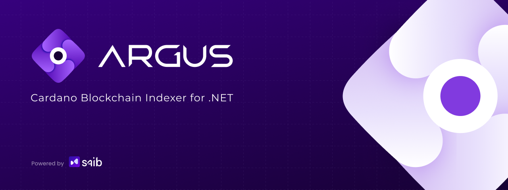
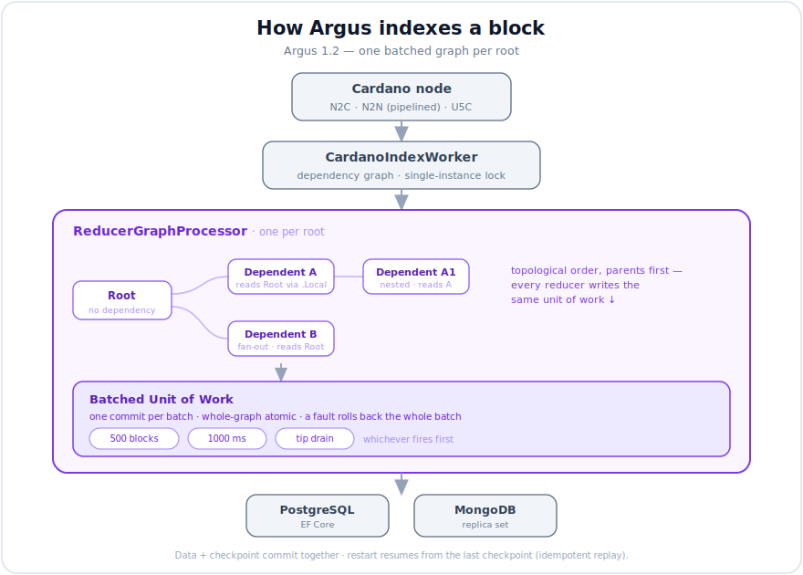
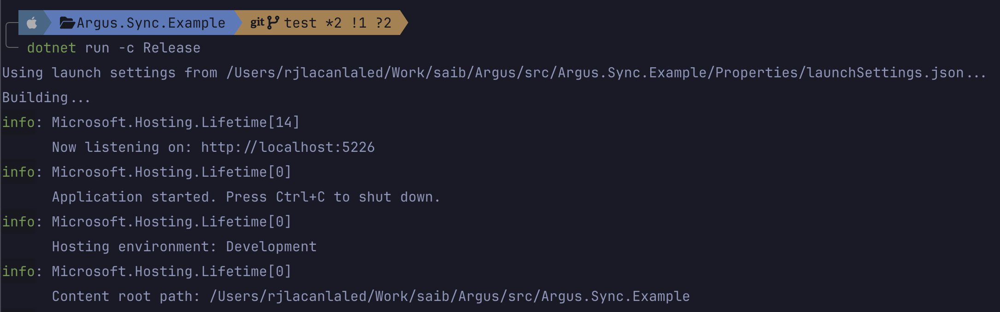

<div align="center">
  
  
  <a href="https://www.nuget.org/packages/Argus.Sync">
    
  </a>
  <a href="https://github.com/SAIB-Inc/Argus/blob/main/LICENSE">
    
  </a>
  <a href="https://github.com/SAIB-Inc/Argus/fork">
    
  </a>
  <a href="https://github.com/SAIB-Inc/Argus/stargazers">
    
  </a>
  <a href="https://github.com/SAIB-Inc/Argus/graphs/contributors">
    
  </a>
  <br>
  <a href="https://dotnet.microsoft.com/download">
    
  </a>
  <a href="https://www.postgresql.org/">
    
  </a>
  <a href="https://www.mongodb.com/">
    
  </a>
  <a href="https://cardano.org/">
    
  </a>
</div>

## 📖 Overview

Argus is a .NET library that turns the Cardano blockchain into structured, queryable data. You write **reducers** that describe how to transform blocks into your own database models, and Argus handles the chain connection, synchronization, rollbacks, ordering, and atomic persistence.

🎥 **Video Tutorial**: For a walkthrough and demo, check out [this video](https://x.com/clarkalesna/status/1859042521856532883).

> **This is the single source of documentation for the repository.** It covers both how to *use* Argus and how the internals work (for contributors). The runnable reference is [`src/Argus.Sync.Example`](src/Argus.Sync.Example).

## ✨ Features

- 🧩 **Customizable reducers** — define exactly how blockchain data is processed and stored.
- 🗄️ **Storage-agnostic** — ship on **PostgreSQL** (Entity Framework Core) or **MongoDB** out of the box; add your own backend behind one interface.
- 🔌 **Flexible connectivity** — connect to a node via Unix socket (N2C), TCP (N2N), or gRPC/UtxoRPC (U5C).
- ⚡ **Batched commits** — a root and all its dependents run as one sequential graph into a single unit of work; one transaction (one fsync) covers a whole batch of blocks, so throughput is bound by your reducer logic, not by per-block durability.
- 🔗 **Reducer dependencies** — declare `[DependsOn(...)]` and a dependent sees its parent's writes in-process, before they're even committed.
- 🚀 **Pipelined N2N** — node-to-node chain-sync keeps many requests in flight and batches block-fetch, so a remote peer is no longer the bottleneck.
- 🔄 **Robust rollback handling** — chain reorganizations and operator-initiated rewinds are first-class.
- 🛡️ **Crash-safe & single-writer** — data and checkpoint commit in one transaction; a per-database lock prevents two indexers from clobbering each other.
- 📊 **Built-in dashboard** — track sync progress in the terminal.

## 🧩 How It Works

| Component | Role |
| --------- | ---- |
| **Chain Provider** | Connects to a Cardano node and streams roll-forward / roll-backward events (`N2CProvider`, `U5CProvider`, `N2NProvider`). |
| **`CardanoIndexWorker`** | The hosted service that drives synchronization: builds the reducer dependency graph, manages connections, and feeds blocks into the pipeline. |
| **`ReducerGraphProcessor`** | One per root reducer. Runs the root and all its dependents in topological order (parents first) through a bounded `System.Threading.Channels` inbox, accumulating blocks into a batch. Backpressure is automatic. |
| **`IReducer`** | Your transformation logic — `RollForwardAsync` / `RollBackwardAsync`. |
| **`IBlockUnitOfWork`** | A framework-managed transactional unit shared by the whole graph for one batch. Reducers register writes against it; the framework commits all of them **and** every reducer's checkpoint together, atomically, when a batch trigger fires. |
| **`IBlockUnitOfWorkFactory`** | The storage-backend seam. One implementation per backend (EF/Postgres, Mongo, …). |
| **Single-instance lock** | Guarantees exactly one active indexer per database (Postgres advisory lock / Mongo lease). |

**A few design points worth knowing up front:**

- **The framework owns commit timing.** Reducers never call `SaveChangesAsync` (or a Mongo equivalent). You register writes through the unit of work; Argus commits your data and every reducer's checkpoint together, in one transaction, once per **batch**. A batch closes when it fills (`Sync:Commit:BatchSize`, default 500), ages out (`Sync:Commit:MaxDelayMs`, default 1000), or the inbox drains at the chain tip — so a single fsync covers many blocks while you never lag the tip. If anything throws, the **whole open batch** rolls back — no partial writes.
- **Dependents read their parent's pending writes.** Across the graph the unit of work shares a single storage handle, so a dependent reducer can see what its parent just wrote via the change-tracker's `Local` view — no DB round-trip, no stale read.
- **Recovery is fail-fast + restart.** Argus does not retry database faults in-process. On an unrecoverable error it stops the host; your supervisor (systemd, Kubernetes, `docker restart`) restarts the process, which resumes from the last committed checkpoint and replays. Because data and checkpoint are committed together, replay is at-least-once and idempotent.

<div align="center">
  
</div>

## 🚀 Getting Started

### 1️⃣ Install

```bash
# Core library (PostgreSQL backend included)
dotnet add package Argus.Sync

# EF Core tooling for migrations + the Postgres provider
dotnet add package Microsoft.EntityFrameworkCore.Design
dotnet add package Npgsql.EntityFrameworkCore.PostgreSQL

# Optional: MongoDB backend
dotnet add package Argus.Sync.MongoDb
```

### 2️⃣ Define your data models

A model is any type implementing `IReducerModel`. The interface requires a `Slot` — Argus uses it to roll your data back during reorganizations.

```csharp
using Argus.Sync.Data.Models;

public record BlockInfo(
    string Hash,
    ulong  Height,
    ulong  Slot,        // required by IReducerModel — used for rollbacks
    DateTime CreatedAt
) : IReducerModel;
```

### 3️⃣ Set up a database context (PostgreSQL)

Extend `CardanoDbContext` and expose your models. Argus manages its own `ReducerStates` table on the same context.

```csharp
using Argus.Sync.Data;
using Microsoft.EntityFrameworkCore;

public class MyDbContext(
    DbContextOptions<MyDbContext> options,
    IConfiguration configuration
) : CardanoDbContext(options, configuration)
{
    public DbSet<BlockInfo> Blocks => Set<BlockInfo>();

    protected override void OnModelCreating(ModelBuilder modelBuilder)
    {
        base.OnModelCreating(modelBuilder);

        modelBuilder.Entity<BlockInfo>(entity =>
        {
            entity.HasKey(b => new { b.Hash, b.Slot });
        });
    }
}
```

### 4️⃣ Implement a reducer

Reducers implement the non-generic `IReducer`. Get your storage handle from the unit of work, register writes, and return — **do not** call `SaveChangesAsync`.

```csharp
using Argus.Sync.Reducers;
using Chrysalis.Codec.Extensions.Cardano.Core;
using Chrysalis.Codec.Extensions.Cardano.Core.Header;
using Chrysalis.Codec.Types.Cardano.Core;
using Microsoft.EntityFrameworkCore;

public class BlockReducer : IReducer
{
    public Task RollForwardAsync(IBlock block, IBlockUnitOfWork uow, CancellationToken ct)
    {
        MyDbContext db = uow.GetStorage<MyDbContext>();

        string hash   = block.Header().Hash();
        ulong  height = block.Header().HeaderBody().BlockNumber();
        ulong  slot   = block.Header().HeaderBody().Slot();

        db.Blocks.Add(new BlockInfo(hash, height, slot, DateTime.UtcNow));
        return Task.CompletedTask; // the framework commits this branch atomically
    }

    public Task RollBackwardAsync(ulong slot, IBlockUnitOfWork uow, CancellationToken ct)
    {
        MyDbContext db = uow.GetStorage<MyDbContext>();
        db.Blocks.RemoveRange(db.Blocks.AsNoTracking().Where(b => b.Slot >= slot));
        return Task.CompletedTask;
    }
}
```

### 5️⃣ Configure `appsettings.json`

```json
{
  "ConnectionStrings": {
    "CardanoContext": "Host=localhost;Database=argus;Username=postgres;Password=postgres;Port=5432",
    "CardanoContextSchema": "public"
  },
  "CardanoNodeConnection": {
    "ConnectionType": "UnixSocket",
    "UnixSocket": { "Path": "/path/to/node.socket" },
    "TCP":  { "Host": "localhost", "Port": 3001 },
    "gRPC": { "Endpoint": "https://your-utxorpc-endpoint", "ApiKey": "..." },
    "NetworkMagic": 764824073,
    "Slot": 139522569,
    "Hash": "3fd9925888302fca267c580d8fe6ebc923380d0b984523a1dfbefe88ef089b66",
    "MaxRollbackSlots": 10000,
    "RollbackBuffer": 10
  },
  "CardanoIndexReducers": {
    "ActiveReducers": [ "BlockReducer" ]
  },
  "Sync": {
    "Dashboard": { "TuiMode": true, "RefreshInterval": 5000 }
  }
}
```

- `NetworkMagic`: `764824073` mainnet, `1` preprod, `2` preview.
- `Slot` / `Hash`: the intersection point to start a fresh sync from (a known block at or before where you want to begin).
- `CardanoIndexReducers:ActiveReducers`: **only the reducers listed here run.** Leave it out to run all discovered reducers.

### 6️⃣ Register services

```csharp
using Argus.Sync.Extensions;

WebApplicationBuilder builder = WebApplication.CreateBuilder(args);

builder.Services.AddCardanoPostgresIndexer<MyDbContext>(builder.Configuration);
builder.Services.AddReducers(builder.Configuration);

WebApplication app = builder.Build();
await app.RunAsync();
```

You pick your storage backend by which method you call: `AddCardanoPostgresIndexer<TContext>` (above) or `AddCardanoMongoIndexer` (see [Storage Backends](#-storage-backends)).

### 7️⃣ Create and apply migrations (PostgreSQL)

```bash
dotnet ef migrations add InitialMigration
dotnet ef database update
```

### 8️⃣ Run

```bash
dotnet run
```

You should see the Argus dashboard as it begins indexing. For a bounded real-node smoke run, see [`src/Argus.Sync.Example/README.md`](src/Argus.Sync.Example/README.md).

<div align="center">
  
</div>

### 9️⃣ Serve your indexed data

Because the data lands in your own database, exposing it is ordinary EF Core:

```csharp
app.MapGet("/api/blocks/latest", async (IDbContextFactory<MyDbContext> dbf) =>
{
    await using MyDbContext db = await dbf.CreateDbContextAsync();
    return await db.Blocks.OrderByDescending(b => b.Height).Take(10).ToListAsync();
});
```

## 🔗 Reducer Dependencies

A reducer can declare a single dependency with `[DependsOn]`. Argus builds a dependency graph at startup, gives **root** reducers (no dependencies) the chain connections, and runs each block through the root and its dependents in topological order.

```csharp
[DependsOn(typeof(BlockReducer))]
public class TransactionReducer : IReducer
{
    public Task RollForwardAsync(IBlock block, IBlockUnitOfWork uow, CancellationToken ct)
    {
        MyDbContext db = uow.GetStorage<MyDbContext>();
        ulong slot = block.Header().HeaderBody().Slot();

        // BlockReducer ran earlier in the graph. Its pending Add() is visible here
        // via the change-tracker's Local view — before it's committed to the DB.
        bool parentWroteThisBlock = db.Blocks.Local.Any(b => b.Slot == slot);
        // ... your read-modify-write logic ...
        return Task.CompletedTask;
    }

    public Task RollBackwardAsync(ulong slot, IBlockUnitOfWork uow, CancellationToken ct)
        => Task.CompletedTask;
}
```

**Rules and behavior:**

- **Single dependency per reducer** (prevents the diamond problem); circular dependencies are rejected at startup.
- **Only root reducers open chain connections** — fewer connections, less node load.
- **The whole graph shares one unit of work per batch.** Every reducer — root and dependents, linear chains and fan-out siblings alike — runs in topological order into the same unit of work, so any dependent reads its parent's uncommitted writes from `Local` (no DB round-trip, no stale read). There is no separate "fork" code path.
- **Start points auto-adjust**: a fresh dependent of an already-synced parent begins at the parent's position instead of replaying from genesis.
- **Atomicity is whole-graph.** The entire graph commits in one transaction per batch; if any reducer throws, the whole open batch rolls back across **every** reducer — a sibling's writes never survive a crash that the parent or another sibling didn't.

## 💾 Storage Backends

A backend is one implementation of `IBlockUnitOfWorkFactory` (create a per-branch transactional unit + read a reducer's checkpoint). Reducers stay backend-agnostic by calling `uow.GetStorage<T>()`.

### PostgreSQL (Entity Framework Core)

The default. Your `CardanoDbContext`-derived context *is* the storage handle:

```csharp
builder.Services.AddCardanoPostgresIndexer<MyDbContext>(builder.Configuration);
builder.Services.AddReducers(builder.Configuration);
```

`uow.GetStorage<MyDbContext>()` returns your context. EF features work as expected — tracked entities, `ExecuteUpdate`/`ExecuteDelete`, raw SQL, ADO.NET, bulk extensions — all enrolled in the framework-owned transaction. (Non-tracked writes such as raw SQL must call `uow.MarkDataChanged()` so an otherwise-empty block isn't skipped by commit deferral.)

### MongoDB

Add the `Argus.Sync.MongoDb` package and register the Mongo indexer:

```csharp
using Argus.Sync.MongoDb;

builder.Services.AddCardanoMongoIndexer(builder.Configuration);
builder.Services.AddReducers(builder.Configuration);
```

```json
{
  "ConnectionStrings": { "CardanoMongo": "mongodb://localhost:27017/?replicaSet=rs0" },
  "Mongo": { "Database": "argus" }
}
```

Reducers obtain the Mongo handle via `uow.GetStorage<MongoStorage>()` (database + transaction session) and pass the session on their writes. **The connection must target a replica set (or sharded cluster)** — MongoDB multi-document transactions require it, and Argus writes your data and the checkpoint in one transaction. A reference reducer lives in [`src/Argus.Sync.Tests/Mongo`](src/Argus.Sync.Tests/Mongo).

## 🔌 Chain Providers

Set `CardanoNodeConnection:ConnectionType` to pick one:

<table>
<thead>
  <tr><th>Connection</th><th>Provider</th><th><code>ConnectionType</code></th><th>Description</th><th>Status</th></tr>
</thead>
<tbody>
  <tr><td><strong>Unix Socket</strong></td><td>N2CProvider</td><td><code>"UnixSocket"</code></td><td>Node-to-Client: Ouroboros mini-protocols over a local node's Unix socket</td><td align="center">✅</td></tr>
  <tr><td><strong>TCP</strong></td><td>N2NProvider</td><td><code>"TCP"</code></td><td>Node-to-Node: chain-sync + block-fetch over TCP/IP</td><td align="center">✅</td></tr>
  <tr><td><strong>gRPC</strong></td><td>U5CProvider</td><td><code>"gRPC"</code></td><td>Remote connection via UtxoRPC, ideal for cloud deployments</td><td align="center">✅</td></tr>
</tbody>
</table>

Custom providers implement `ICardanoChainProvider`.

## 🔙 Rollbacks

**Automatic (chain reorganizations).** When the node rolls the chain back, Argus invokes each affected reducer's `RollBackwardAsync(slot, …)`. The slot boundary respects the provider's rollback semantics so your deletion logic is uniform — typically `Where(x => x.Slot >= slot)`:

- **N2C (Unix socket)** — exclusive: the rollback point itself is preserved (removes `slot > point`).
- **U5C (gRPC)** — `Undo` is inclusive (removes `slot >= point`); `Reset` is exclusive.
- **N2N (TCP)** — same exclusive mapping as N2C.

A configurable depth limit (`CardanoNodeConnection:MaxRollbackSlots`, default `10000`) guards against runaway rollbacks, and a rolling buffer of recent intersections (`RollbackBuffer`, default `10`) supports recovery.

**Operator-initiated (manual rewind).** To force the index to rewind to a specific point — e.g. to recover from a bad deploy — enable rollback mode. The whole feature lives under `Sync:Rollback:*`:

```json
{
  "Sync": {
    "Rollback": {
      "Enabled": true,
      "Hash": "<block hash to rewind to>",
      "Slot": 12345678,
      "Reducers": {
        "SomeReducer": { "Enabled": false }
      }
    }
  }
}
```

On the next start every reducer rewinds to the global `Hash`/`Slot`; you can override the target per reducer under `Reducers:{name}:Hash`/`:Slot`, or exclude a reducer with `Reducers:{name}:Enabled: false`. **It re-applies on every start while enabled, so turn it back off once the rewind has run.**

## ⚙️ Configuration Reference

| Key | Default | Description |
| --- | ------- | ----------- |
| `ConnectionStrings:CardanoContext` | — | PostgreSQL connection string. |
| `ConnectionStrings:CardanoContextSchema` | — | Schema for Argus tables; also scopes the single-instance lock. |
| `ConnectionStrings:CardanoMongo` | — | MongoDB connection string (Mongo backend; replica set required). |
| `Mongo:Database` | `argus` | MongoDB database name (Mongo backend). |
| `CardanoNodeConnection:ConnectionType` | — | `UnixSocket` \| `TCP` \| `gRPC`. |
| `CardanoNodeConnection:UnixSocket:Path` | — | Node socket path (N2C). |
| `CardanoNodeConnection:TCP:Host` / `:Port` | — | Node host/port (N2N). |
| `CardanoNodeConnection:gRPC:Endpoint` / `:ApiKey` | — | UtxoRPC endpoint/key (U5C). |
| `CardanoNodeConnection:NetworkMagic` | `2` | `764824073` mainnet · `1` preprod · `2` preview. |
| `CardanoNodeConnection:Slot` / `:Hash` | — | Intersection point for a fresh sync. |
| `CardanoNodeConnection:MaxRollbackSlots` | `10000` | Maximum automatic rollback depth. |
| `CardanoNodeConnection:RollbackBuffer` | `10` | Recent intersections retained per reducer. |
| `CardanoIndexReducers:ActiveReducers` | (all) | Allow-list of reducer class names to run. |
| `Sync:Pipeline:ChannelCapacity` | `256` | Bounded inbox size per reducer graph (backpressure). |
| `Sync:Commit:BatchSize` | `500` | Max blocks committed per transaction — one fsync per batch. |
| `Sync:Commit:MaxDelayMs` | `1000` | Max time (ms) a batch stays open before committing, even if not full. |
| `CardanoNodeConnection:TCP:PipelineDepth` | `100` | Max in-flight N2N chain-sync requests while catching up (pipelining). |
| `Sync:SingleInstanceLock:Enabled` | `true` | Enforce one active indexer per database. |
| `Sync:Rollback:Enabled` | `false` | Operator rollback mode (see [Rollbacks](#-rollbacks)). |
| `Sync:Worker:ExitOnCompletion` | `true` | Exit the process when sync reaches tip (set `false` in tests). |
| `Sync:Dashboard:TuiMode` | `true` | Terminal dashboard; `RefreshInterval` (ms) controls redraw. |

## 🛠️ Building & Testing

```bash
# Build
dotnet build

# Run the example indexer
dotnet run --project src/Argus.Sync.Example

# Run the test suite
dotnet test

# Skip integration tests (which need a live node and/or Mongo)
dotnet test --filter "Category!=Integration"

# Pack the NuGet packages
dotnet pack src/Argus.Sync           --configuration Release
dotnet pack src/Argus.Sync.MongoDb   --configuration Release
```

Integration tests run against a real preprod/preview node and a local PostgreSQL (and, for the Mongo suite, a MongoDB replica set); they self-skip when those aren't reachable. The end-to-end suite under `src/Argus.Sync.Tests/EndToEnd` exercises the worker, the dependency graph, whole-graph atomicity, batch commits, crash-recovery, N2N pipelining, the single-instance lock, and both storage backends against real Conway-era blocks.

## 📂 Project Layout

| Project | Purpose |
| ------- | ------- |
| `src/Argus.Sync` | Core library: worker, pipeline, reducers, EF/Postgres backend. |
| `src/Argus.Sync.MongoDb` | MongoDB storage backend (`AddCardanoMongoIndexer`). |
| `src/Argus.Sync.Example` | Runnable reference app with example models and reducers. |
| `src/Argus.Sync.Tests` | Unit + end-to-end tests. |

## 🔼 Migrating

> **1.1 → 1.2:** no code changes — the reducer contract is identical. Batched whole-graph commits and pipelined N2N apply automatically. Optionally tune `Sync:Commit:BatchSize` (500), `Sync:Commit:MaxDelayMs` (1000), and `CardanoNodeConnection:TCP:PipelineDepth` (100). Durability is now per-batch: after a hard crash, up to `BatchSize` blocks replay from the last committed checkpoint (idempotent — data and checkpoint commit together).

### From v0.x (pre-rearchitecture)

The rearchitecture — channel pipeline, storage-agnostic unit of work, and the package split — is a major version with breaking changes. The mapping:

| Area | Before (v0.x) | Now |
| --- | --- | --- |
| Reducer interface | `IReducer<T>` (generic) | `IReducer` (non-generic) |
| `RollForwardAsync` | `RollForwardAsync(Block block)` | `RollForwardAsync(IBlock block, IBlockUnitOfWork uow, CancellationToken ct)` |
| `RollBackwardAsync` | `RollBackwardAsync(ulong slot)` | `RollBackwardAsync(ulong slot, IBlockUnitOfWork uow, CancellationToken ct)` |
| Block type | `Block` (`Chrysalis.Cbor.Types…`) | `IBlock` (`Chrysalis.Codec.Types.Cardano.Core`) |
| Data access | inject `IDbContextFactory<T>`; call `db.SaveChangesAsync()` | `uow.GetStorage<T>()`; the framework commits — **never** call `SaveChangesAsync` |
| Postgres registration | `AddCardanoIndexer<T>()` (core package) | `AddCardanoPostgresIndexer<T>()` from the **`Argus.Sync.EntityFramework`** package |
| Reducer registration | `AddReducers<T, V>(config)` | `AddReducers(config)` (non-generic) |
| Packages | `Argus.Sync` (EF baked in) | `Argus.Sync` (core) **+** `Argus.Sync.EntityFramework` (Postgres) or `Argus.Sync.MongoDb` |
| `IReducerModel` | marker interface | now requires `ulong Slot { get; }` |
| Rollback-mode config | `CardanoIndexReducers:RollbackMode:*` | `Sync:Rollback:*` |
| Removed config | `Sync:State:ReducerStateSyncInterval` | gone |
| N2N (TCP) provider | not implemented | supported (`ConnectionType: "TCP"`) |

**To upgrade a reducer in practice:** drop the `IDbContextFactory` constructor parameter and the `<T>` on `IReducer`; change both methods to take `(…, IBlockUnitOfWork uow, CancellationToken ct)`; replace `dbContextFactory.CreateDbContext()` with `uow.GetStorage<YourDbContext>()`; and delete every `SaveChangesAsync` call. Then add the `Argus.Sync.EntityFramework` package reference, and switch `AddCardanoIndexer<T>` → `AddCardanoPostgresIndexer<T>` and `AddReducers<T, V>` → `AddReducers`.

## 🤝 Contributing

1. Fork the repository
2. Create a feature branch: `git checkout -b feature/amazing-feature`
3. Commit your changes: `git commit -m 'feat: add amazing feature'`
4. Push the branch: `git push origin feature/amazing-feature`
5. Open a Pull Request

## 📄 License

Argus is licensed under the Apache 2.0 License — see [LICENSE](LICENSE).

---

<div align="center">
  <p>Made with ❤️ by <a href="https://saib.dev">SAIB Inc</a> for the Cardano community</p>
</div>
